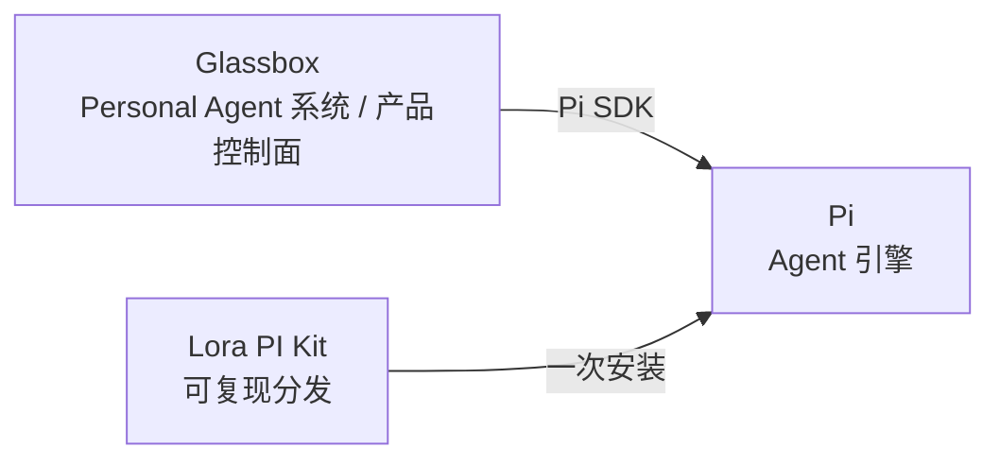

# @lora-sys/pi-kit

<p align="center">
  <a href="./LICENSE"></a>
  <a href="https://github.com/earendil-works"></a>
  <a href="https://nodejs.org/"></a>
  
</p>

Lora PI Kit 是 Pi 的可复现分发（distribution）。目标只有一句话：**把刚安装好的裸 Pi，一次安装变成 Lora 自己的完整 Pi 工作环境。**

它服务于三个场景：Lora 本地 coding、Glassbox Personal Agent 执行、Herdr 委派的 worker。技能快照、扩展、Profile、锁文件全部随包固定，同一个 Kit 版本在本地、测试机和 Linux Server 上得到一致的环境。

## 三层定位



Pi 提供运行原语（agent loop、会话、模型接入、SDK）。Kit 负责分发（技能、扩展、MCP、Profile、锁）。Glassbox 负责产品真相（身份、权限、Task、Taste、Memory）。Kit 不能扩大 Glassbox 的授权。

## 目录结构

```text
lora-pi-kit/
├── package.json         # Pi Package Manifest（keywords: ["pi-package"]）
├── extensions/          # Pi 扩展
│   ├── core/            # runtime、context hooks、tool policy、notifications
│   ├── glassbox/        # policy bridge、trace hooks、taste context、feedback bridge
│   └── mcp/             # stdio JSON-RPC client、registry、tool adapter
├── skills/              # 来自 lora-sys/skills 的锁定版本快照
├── prompts/             # base、coding、review、worker 提示词模板
├── profiles/            # 各运行角色的 Profile
├── mcp/                 # registry.json
├── config/              # settings.template.json、models.template.json
├── locks/               # pi.lock.json、skills.lock.json、compatibility.json
├── bin/                 # 可执行入口
├── src/  tests/         # 源码与测试
└── scripts/             # doctor、install、update、sync-skills
```

## Profiles

| Profile | 用途 |
| :--- | :--- |
| `main-agent` | Glassbox Personal Agent 运行时，暴露完整已审技能目录 |
| `local-coding` | 本地交互式 coding 环境 |
| `owner-direct` | Owner 私聊直连 |
| `qq-group` | 群聊远端，工具面收窄 |
| `herdr-worker` | Herdr 委派的 Pi worker 执行 |
| `test` | 确定性测试，隔离 agentDir |

Profile 决定启用哪些能力，但**不能扩大 Glassbox Authorization**。远端 Profile 保持窄工具面，Glassbox 还可以在 Run 开始前用持久化的群白名单再收窄一次。

## 快速开始

要求：Pi 0.85.1、Node.js >= 22.19（Windows 已在 Node 24.12.0 上验证；Linux / macOS 是部署目标，本版本不声明宿主验证）。

```powershell
npm ci

# 安装到显式隔离目录，安装器先验证捆绑 Skills 再改 settings
npm run install-kit -- --agent-dir C:/tmp/lora-test --profile test

# 用选定资源启动 Pi，关闭环境级 Extension / Skill / prompt / theme 发现
npm run run-profile -- --agent-dir C:/tmp/lora-test -- --help

# 体检
npm run doctor
```

模型和凭据在 agentDir 里通过 Pi 配置，永远不进包。直接运行 `pi` 命令不带这个启动器，会保留 Pi 的常规环境发现行为。

## 隔离沙箱执行

`createDockerSandboxExecutor` 是 Kit 的执行边界，覆盖 Pi 的 8 个原生工具和一个固定的 `agent-browser` CLI。它在 Docker 容器里启动一个只有工具的进程，**不会**启动另一个模型会话。

安全模型的关键约束：

- 容器内**无网络**、非 root、只读根文件系统、tmpfs、进程 / 内存 / CPU 配额，全部由 Docker 强制。
- 不存在宿主执行 fallback。Docker daemon、镜像、CLI 或 PowerShell 缺失就返回不可用或失败。
- 镜像必须带 SHA-256 digest，浮动 tag 在运行时直接拒绝。
- workspace 路径、policy 版本、session ID 必须来自 Glassbox 服务端的受保护配置和授权记录。**永远不接受来自工具参数或 workspace 文件的镜像、路径、主体或 policy。**
- Kit 不授予产品权限，不检测已出现在模型 prompt 里的文本外泄。跨 session 的 workspace 写归属和每次调用的重授权由服务端维护。
- 默认无网络策略同时挡掉一般 HTTP（含浏览器 URL）。受控出口（controlled egress）需要单独评审的后端才能启用，当前版本未启用。

### 构建并锁定运行时镜像

```bash
npm ci
npm run build
docker build -f Dockerfile.sandbox -t lora-pi-kit-sandbox:reviewed .
docker image inspect lora-pi-kit-sandbox:reviewed --format '{{.Id}}'
npm run sandbox-smoke -- sha256:<the-image-id>
npm run lock-sandbox-image -- sha256:<the-image-id>
```

把得到的 `sha256:...` 镜像 ID 传给 `createDockerSandboxExecutor({ image })`。`Dockerfile.sandbox` 通过 `package-lock.json` 钉住 Pi，钉住 agent-browser `0.38.1`、fd `10.5.0`、PowerShell 上游 `7.5.3` 包哈希，Node 基础镜像也用 digest。`locks/sandbox-image.json` 记录评审过的运行时镜像和 Kit 产物的哈希，检查哈希前先 `npm run build`。

### 运行时 API

调用 `doctor()` 确认可用后再对外声明工具可用。`openSession` 接受 `{ sessionId, workspacePath, writable, policyVersion, network: "none" }`，返回带 Pi schema 和实际可用性的 `toolDefinitions`；`execute({ id, name, params, signal, onUpdate })` 执行原生 Pi 工具，结果保留文本与图片 block、details、错误状态和流式更新。`executeCli` 只接受固定的 `agent-browser` 可执行文件加参数数组。`cancel(id)` 会终结整个 session 以停掉所有后代进程，之后需要重新 openSession。结束时总是调用 `close()`。

每个受信 `sessionId` 通过 SHA-256 映射到一个 Docker 容器名，容器打上 session 哈希、镜像和 launch token 标签。服务重启后，对每个持久化的未决 session 调用 `ensureSessionStopped(sessionId)` 再释放 workspace 写租约：Kit 检查容器标签、按 Docker ID 删除、再复查 ID，Docker 确认容器不存在才算成功；Docker 报错或标签不匹配就保持租约未决。恢复不依赖旧镜像仍然选中，session 哈希和 Kit 属主标签足以定位容器。早于该映射机制创建的容器无法仅凭 `sessionId` 恢复，需要运维人工确认。

### 与 Profile 启动器集成

`local-coding` 和 `herdr-worker` Profile 要求用 `run-profile` 并传绝对 `--workspace` 路径。启动器校验锁定镜像、停用 Pi 原生内置工具，然后注册 8 个由 Docker session 支撑的同名工具；沙箱扩展初始化失败就直接退出。Herdr 必须从其受信调度器获得 workspace 和写租约，Kit Profile 本身不授予访问权，也不与 Glassbox 协调写入。

```bash
npm run run-profile -- --agent-dir /trusted/pi-state --workspace /authorized/project -- --print "Inspect the project"
```

## Skills 同步与 Kit 更新

捆绑的 Skills 来自 [`lora-sys/skills`](https://github.com/lora-sys/skills) 的完整评审 commit。同步命令发现所有结构有效的 `SKILL.md`，验证名称与描述，复制不可变 Git blob，忽略未提交的源码修改，然后整体替换快照。Profile 仍然决定 Pi 实际加载哪些 Skills。

```powershell
npm run sync-skills -- --source C:/repos/skills --commit 54bf1404a040395a6744549f3d4723d62022fb5b
npm test
npm run build
```

激活一个评审过的本地 Kit 修订版时显式给路径。更新器先验证再改已安装包的选择，不会拉浮动分支，也不会更新 Pi 本身。

```powershell
npm run update-kit -- --agent-dir C:/tmp/lora-test --profile test --root C:/repos/reviewed-lora-pi-kit
```

## MCP

安装包本身不会启动任何 MCP server。MCP 定义默认全部禁用，除非 Profile 和 registry 同时选中。`test` Profile 加载锁定的 `unslop` Skill 和本地确定性 stdio MCP fixture。Glassbox 托管的 MCP 调用需要宿主授权回调，本地 Profile 的 settings 不能替代 Glassbox 权限。

```text
Pi → Lora PI Kit MCP Adapter → MCP Registry → Profile 按需选择 → Tools
```

## SDK 接入

SDK 宿主用 `loadInstalledProfile(agentDir)` 拿到公开的 Pi 资源加载选项，传给 `DefaultResourceLoader`，创建 session 后调 `session.bindExtensions({})`。关闭时先发 `session_shutdown`（`reason: "quit"`）再 dispose session，保证 MCP 子进程退出。Glassbox 使用自己的授权工具注册和产品状态，不走这条路径。

## License

MIT
